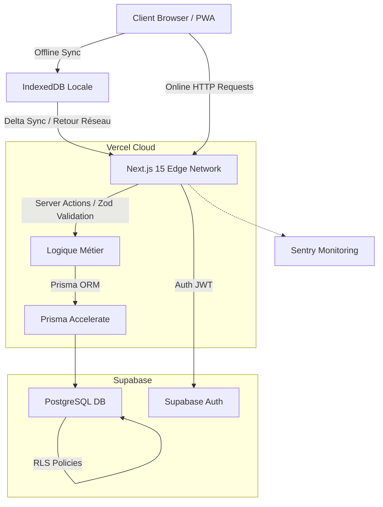

# Architecture Technique (High-Level) 📐

L'architecture de Regional Express est conçue pour être robuste, rapide et résiliente, s'appuyant sur des technologies SaaS de nouvelle génération.

## Diagramme d'Architecture

## Choix Technologiques
1. **Framework** : Next.js 15 (App Router) permettant d'unifier Frontend et Backend.
2. **Offline-First** : IndexedDB (Dexie) utilisé comme cache transactionnel (Delta Sync).
3. **ORM** : Prisma, pour le typage end-to-end strict avec TypeScript.
4. **Authentification & DB** : Supabase. Fournit un PostgreSQL géré avec le concept de Row Level Security (RLS) pour sécuriser le multi-tenant.
5. **Observabilité** : Sentry capte les erreurs et transactions de performance.
